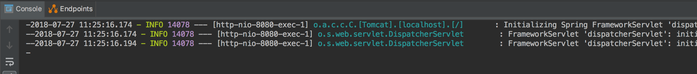

# example-spring-boot-1.5.x-service
A simple Spring-boot 1.5.X service to compare with different frameworks

A single endpoint which retrieves data from Mongo

`curl -X GET http://localhost:8080/books`

**Stack:**
- Spring Boot 1.5.X
- Spring MVC
- Reactive Spring Data - Mongo

### Setup Mongo

You can use the embedded Mongo buy uncommenting **de.flapdoodle.embed** the dependency in the pom.xml.

You can also easily setup a local Mongo running from a local [Docker](https://www.docker.com/docker-mac) image. Pull the [Mongo image](https://hub.docker.com/_/mongo/) and run remembering to use the **-p** option to the port. e.g:

`docker run -p 27017:27017 --name some-mongo mongo`

_fig.1 thread per request_

### Spring Boot 1.5.X features

* one thread-per-request execution model
    - synchronous and blocking IO
    - the size of the servlet thread pool can be a bottleneck
    - database connection pool size need to be coordinated with servlet thread pool
* Servlet Stack: 
    - Spring MVC (web framework, controllers etc, uses Tomcat by default)
    - Servlet container (Tomcat, etc)
    - Servlet API (blocking)